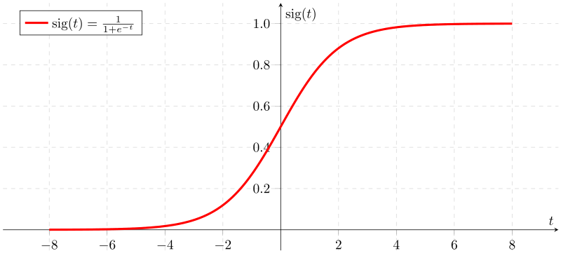

# Machine Learning Glossary

Mastering the Language of Machine Learning

## How to use this markdown?

- **The Fastest Way:** Read the underlined words.
- **Deeper Understaing:** Read the whole meaning and the example.

## The Glossary

### General Machine Learning (ML)

- **Linear regression** $\equiv$
  a statistical method used to model the relationship between a categorical dependent variable and one or more independent variables. a popular method in the field of machine learning for solving regression problems, where the goal is <ins>to predict a continuous numerical value</ins>.  
  The linear regression model assumes a linear relationship between the dependent variable and the independent variables, which means that the relationship can be expressed mathematically as a straight line. The model estimates the coefficients of the line, which represent the slope and intercept.  
  Once the model has been trained on a set of training data, it can be used to make predictions on new data by plugging in the values of the independent variables and calculating the corresponding predicted value of the dependent variable.  
  **example:**  
  Suppose we have a dataset of houses that includes the size of the house in square feet (the independent variable) and the price of the house in dollars (the dependent variable). We can use linear regression to model the relationship between these two variables and make predictions on new data.

1. First, we would split the data into a training set and a testing set. The training set would be used to train the linear regression model, while the testing set would be used to evaluate its performance.
2. Next, we would fit the linear regression model to the training data by estimating the coefficients of the line that best fits the data.
3. Once the model has been trained, we can use it to make predictions on new data by plugging in the value of the independent variable (house size) and calculating the corresponding predicted value of the dependent variable (house price). For example, if we have a new house that is 1500 square feet in size, we can use the linear regression model to predict its price by calculating the value of the line at x=1500.
4. Finally, we would evaluate the performance of the model on the testing set by comparing the predicted values to the actual values of the dependent variable. We can use metrics such as mean squared error to measure how well the model is able to predict the dependent variable based on the independent variable.

---

- **Logistic regression** $\equiv$
  a statistical method used to model the relationship between a categorical dependent variable and one or more independent variables. a popular method in the field of machine learning for solving binary classification problems, where the goal is <ins>to predict whether an observation belongs to one of two possible classes</ins>.  
  The logistic regression model uses a logistic function to transform the output of a linear regression model into a probability value between 0 and 1, which can then be interpreted as the probability of an observation belonging to a certain class. The logistic function, also known as the sigmoid function, is an S-shaped curve that maps any real-valued number to a value between 0 and 1.  
  **Example:**  
  Suppose you are a credit card company and you want to predict whether a credit card application will be approved or denied based on various factors such as the applicant's income, credit score, and employment status. You have a dataset of past credit card applications and their outcomes, which you can use to train a logistic regression model.

1. First, you would clean and preprocess the data, which might involve filling in missing values, encoding categorical variables, and standardizing numeric variables. You would then split the data into training and testing sets, with the majority of the data used for training the model and a smaller portion used for testing its accuracy.
2. Next, you would fit a logistic regression model to the training data using an appropriate software package, such as scikit-learn in Python. The model would estimate the probability of a credit card application being approved based on the values of the independent variables.
3. Once the model is trained, you can use it to make predictions on new credit card applications. For example, you could input the values of income, credit score, and employment status for a new applicant, and the model would output the predicted probability of the application being approved.
4. Based on the predicted probabilities, you can then set a threshold value (e.g., 0.5) to convert the probabilities into binary class labels (approved or denied). You can evaluate the performance of the model on the test set using metrics such as accuracy, precision, recall, and F1 score.

---

- **Sigmoid Function** $\equiv$
  a mathematical function used in logistic regression to model the relationship between the dependent variable and the independent variables. The sigmoid function <ins>takes any input value and maps it to a value between 0 and 1</ins>, which can be interpreted as a probability.
  $$f(x) = \frac{1}{1 + e^{-x}}$$
  

---

- **Cost Function** $\equiv$
  a mathematical function that <ins>measures how well a machine learning model is performing</ins> on a particular task. The goal of the cost function is to compute a single scalar value that represents the "cost" incurred by the model's predictions compared to the true values.

  $$J(\theta) = -\frac{1}{m} \sum_{i=1}^{m} [y^{(i)}\log(h_\theta(x^{(i)})) + (1-y^{(i)})\log(1 - h_\theta(x^{(i)}))] + \frac{\lambda}{2m}\sum_{j=1}^{n}\theta_j^2$$  
  In this equation:

  $J(\theta)$ is the cost function  
   $m$ is the number of training examples  
  $y^{(i)}$ is the true label of the $i$-th training example  
  $h_\theta(x^{(i)})$ is the predicted label of the $i$-th training example, given the model parameters $\theta$  
  $\lambda$ is the regularization parameter  
  $n$ is the number of features in the input data  
  $\theta_j$ is the $j$-th element of the vector of model parameters $\theta$

  The cost function for logistic regression combines the negative log-likelihood of the data with a regularization term to prevent overfitting. The negative log-likelihood measures how well the model predicts the true labels, while the regularization term penalizes large values of the model parameters to encourage simpler models that are less likely to overfit the training data. The optimal values of the model parameters can be found by minimizing the cost function using an optimization algorithm such as gradient descent.

---

- **Negative Log-likelihood** $\equiv$
  <ins>a cost function to optimize models</ins> that predict probabilities for classification problems.
  $$L(\theta) = -\sum_{i=1}^m y_i \log h_\theta(x_i) + (1 - y_i) \log (1 - h_\theta(x_i))$$

---

- **Optimization** $\equiv$
  Optimization is the process of finding the best possible solution to a problem or a set of constraints, given a set of variables and some objective or cost function that defines what "best" means in the context of the problem. In the context of machine learning, optimization is the process of <ins>finding the set of model parameters that minimize the cost function</ins> or maximize the performance metric on a given dataset.

---

- **Gradient Descent** $\equiv$
  <ins>an optimization algorithm used to minimize a cost function</ins> by iteratively adjusting the parameters of a model in the direction of steepest descent of the cost function.

---

- **The Described Concepts in an Example (Use a paper and  a pen!):**  
  Let's consider the problem of fitting a straight line to a set of data points using linear regression. In this problem, we want to find the best possible line that fits the data, where "best" is defined as minimizing the sum of the squared errors between the predicted values and the true values.  
  We can define the cost function as follows:

  $$J(\theta) = \frac{1}{2m} \sum_{i=1}^m (h_\theta(x^{(i)}) - y^{(i)})^2$$  
  Here:  
  $J(\theta)$ is the cost function,  
  $\theta$ represents the model parameters (in this case, the slope and intercept of the line),  
  $m$ is the number of data points,  
  $x^{(i)}$ and $y^{(i)}$ represent the $i$-th data point, and  
  $h_\theta(x^{(i)})$ represents the predicted value of $y$ for the $i$-th data point.

  The goal of optimization is to find the values of $\theta$ that minimize the cost function $J(\theta)$. We can use an optimization algorithm such as gradient descent to iteratively update the values of $\theta$ until the cost function is minimized.

  The update rule for gradient descent is:

  $$\theta_j := \theta_j - \alpha \frac{\partial}{\partial \theta_j} J(\theta)$$

  Here, $\alpha$ is the learning rate, which controls the step size in each iteration of the optimization algorithm.  
  The partial derivative of the cost function with respect to $\theta_j$ can be computed using the chain rule:

  $$\frac{\partial}{\partial \theta_j} J(\theta) = \frac{1}{m} \sum_{i=1}^m (h_\theta(x^{(i)}) - y^{(i)})x_j^{(i)}$$

  We can then update the values of $\theta$ as follows:

  $$\theta_0 := \theta_0 - \alpha \frac{1}{m} \sum_{i=1}^m (h_\theta(x^{(i)}) - y^{(i)})$$

  $$\theta_1 := \theta_1 - \alpha \frac{1}{m} \sum_{i=1}^m (h_\theta(x^{(i)}) - y^{(i)})x^{(i)}$$

  We can repeat these updates until the cost function $J(\theta)$ is minimized, at which point we have found the best possible values of $\theta$ for the linear regression problem.

  Overall, optimization is a key component of machine learning, and is used to find the optimal values of model parameters for a wide variety of problems.

---

---

### Natural Language Processing (NLP)

- **Sentiment** $\equiv$
  the overall <ins> emotional tone or attitude expressed in a piece of text</ins>.  
  **Example:**  
  the sentence "I love this pizza, it's the best I've ever had!" expresses a positive sentiment with a high degree of intensity, while the sentence "I didn't like the movie very much" expresses a negative sentiment with a low degree of intensity.

---

- **Sentiment Analysis** $\equiv$
  using natural language processing and machine learning techniques to automatically <ins>analyze and classify opinions</ins>, emotions, and attitudes expressed in text data; to determine whether a piece of text expresses a _positive_, _negative_, or _neutral_ sentiment.

---

- **Vocabulary** $\equiv$
  <ins>a collection of all the unique words</ins> or terms that appear <ins>in a corpus of text</ins>.  
  **Example:**  
  ["Mary", "had", "a", "little", "lamb", "Its", "fleece", "was", "white", "as", "snow"]

---

- **Sparse Representation** $\equiv$
  a type of data <ins>representation where the majority of the values in the data are zero</ins>, and only a small subset of the values are non-zero.  
  **Example:**  
  "Mary had a little lamb" == [1, 1, 1, 1, 1, 0, 0, 0, 0, 0, 0]

---

- **Frequency Mapping** $\equiv$
  the process of <ins>counting the occurrence of words in a given text</ins> or corpus.  
  **Example:**  
  "Mary had a little lamb. Its fleece was white as snow."  
  {"Mary": 1,
  "had": 1,
  "a": 1,
  "little": 1,
  "lamb": 1,
  "Its": 1,
  "fleece": 1,
  "was": 1,
  "white": 1,
  "as": 2,
  "snow": 1}

---

- **Sentiment Feature Extraction** $\equiv$
  a process of <ins>extracting features from text data</ins> that can be used to identify the sentiment or emotion expressed in the text.  
  **Example:**  
  Consider the following tweet:
  "Mary had a little lamb. Its fleece was white as snow but the butcher didn't care."
  We can use the vocabulary to extract the features for this tweet as follows:

1. Feature 1: Bias unit equal to 1
2. Feature 2: Sum of positive frequencies for every unique word in the tweet: 0 (since there are no positive words in the tweet)
3. Feature 3: Sum of negative frequencies for every unique word in the tweet: 1 (sum of negative frequency for "butcher")  
   Thus, the vector representation for this tweet would be [1, 0, 1], indicating that it has a negative sentiment due to the negative word "butcher".

---

- **Tokenization** $\equiv$
  the process of <ins>breaking down a string of text into individual words</ins> or terms, known as tokens.  
  **Example:**  
  Original text: "The quick brown fox jumps over the lazy dog."  
  Tokenized text: ["The", "quick", "brown", "fox", "jumps", "over", "the", "lazy", "dog", "."]

---

- **Lowercasing** $\equiv$
  the process of <ins>converting all the letters in a text to lowercase</ins>.  
  **Example:**  
  "The" => "the"

---

- **Stemming** $\equiv$
  the process of <ins>reducing inflected or derived words to their base or root form</ins> in order to normalize and group words with similar meanings.  
  **Example:**  
  reduce words such as "running," "runs," and "runner" to the common stem "run."

---

- **Stop Words** $\equiv$
  <ins>words</ins> that are commonly used in a language but are typically ignored by search engines and other text analysis tools because they <ins>do not carry significant meaning</ins> or contribute to the understanding of the text.  
   **Example:**  
   "the," "a," "an," "and," "of," "to," "in," "that," "is," "for," and "it."

---
